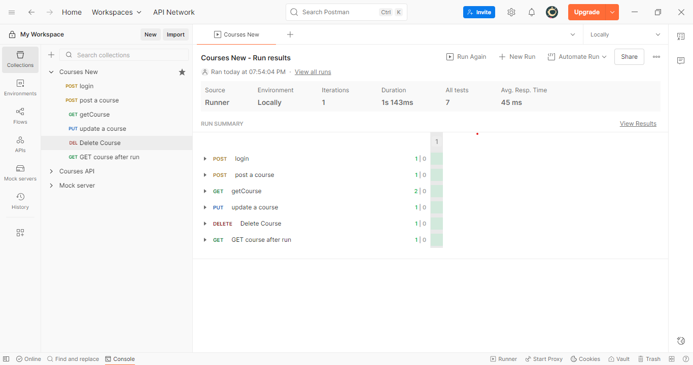
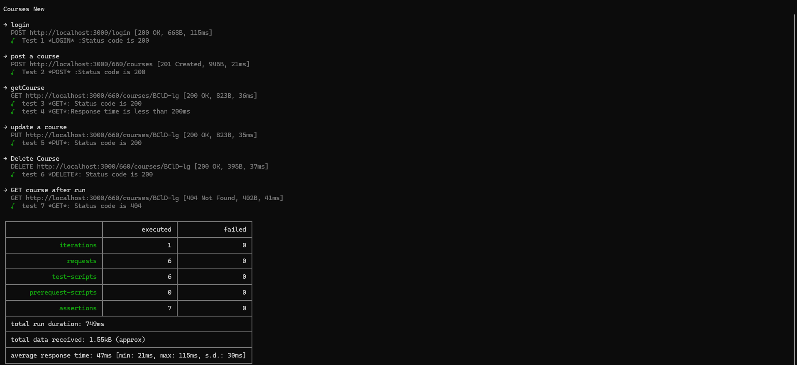
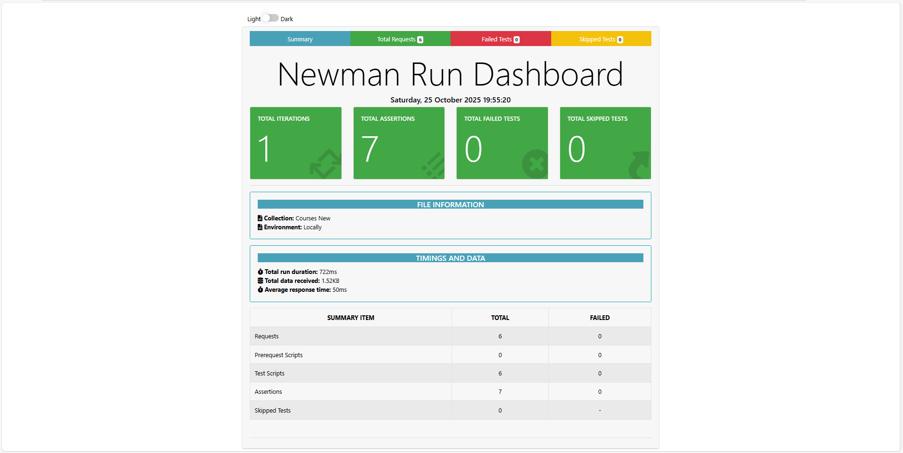
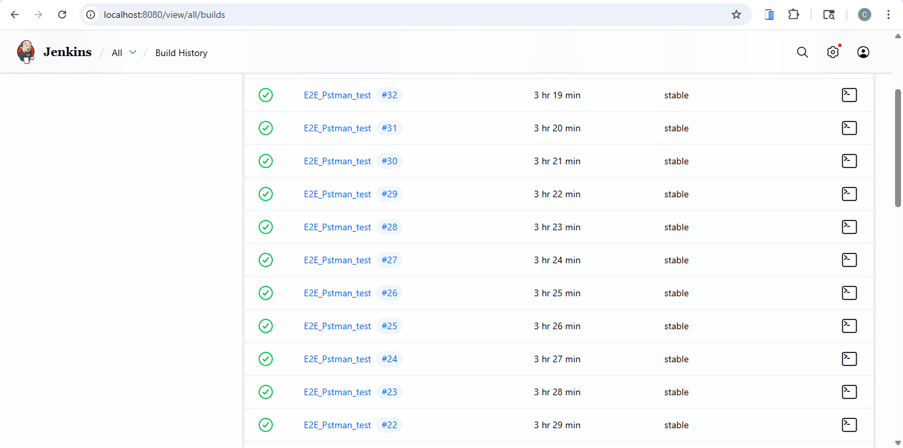

# 👋 Hi, I'm Amel Chenni — QA Test Engineer & Front-End Developer

🌱 I am a **QA Test Engineer** with a solid **Front-End background**, specialized in **automation, API, and manual testing**. I focus on building reliable, maintainable, and fully tested applications.

💻 Successfully delivered multiple real-world projects covering **E2E Automation, API Testing, Manual QA**, and Front-End development.

---

## 🛠️ Skills & Technologies

- **Languages & Web:** HTML5, CSS3 (Flexbox, Grid, Tailwind CSS), JavaScript (ES6+)
- **Frameworks & Libraries:** React, Redux, Bootstrap
- **Testing & QA Tools:** Cypress (UI & API), Postman, Newman, Mochawesome
- **CI/CD & Concepts:** Jenkins, GitHub Actions, Git, **Page Object Model (POM)**, **Data-Driven Testing**, API Testing, Boundary Value Analysis (BVA).

---

## 🚀 Featured QA Projects

### 1️⃣ Todo App — Cypress E2E Automation
- **Description:** Complete E2E Automation for a Todo app using Cypress. Includes **UI & API testing**, utilizing best practices like POM and Data-Driven Tests.
- **Highlights:**
  - **API-based Login** for streamlined execution and session management.
  - CRUD operations tested via both UI and API layers.
  - Automated HTML reports generated with Mochawesome.
- **Links & Reports:**
  [GitHub Repo](https://github.com/AmelChenni/Cypress-E2E-TodoApp-Testing) | [📊 Mochawesome Report](cypress/reports/mochawesome.html)
- **Screenshots:**
  
  

---

### 2️⃣ Courses API — E2E API Testing
- **Description:** End-to-End API testing project using **Postman**, **Newman**, and integrated with **Jenkins** for continuous testing.
- **Highlights:**
  - Full CRUD operations testing (Functional & Negative Testing, Assertions).
  - Response validation and JSON schema verification.
  - Automated Newman execution with HTML reporting.
  - **Jenkins CI/CD setup** for scheduled test runs and build monitoring.
- **Links & Reports:**
  [GitHub Repo](https://github.com/AmelChenni/-E2E-API-Testing-Project-Courses-Application)
- **Screenshots:**
  
  
  
  

---

### 3️⃣ Manual QA Project — To-Do Application
- **Description:** Comprehensive Manual QA testing for the Signup feature of a To-Do app, focusing on quality assurance artifacts.
- **Highlights:**
  - Full Functional & Negative Testing coverage.
  - Implementation of **Boundary Value Analysis (BVA)**.
  - Basic Security Testing (SQL Injection / XSS).
  - Test Cases & Bug Reports fully documented.
- **Links & Reports:**
  [Project Docs (Test Cases & Reports)](https://docs.google.com/spreadsheets/d/1MliztrE7Gfmjawfpu6L-VFE9wZbYD2FSqcDvXYrEEE4/edit#gid=0)
- **Screenshots:**
  
  
  

---

## 🌐 Front-End Projects (Bonus)

- **A-Shop React E-commerce Store** — State management, routing, dynamic cart
  [GitHub](https://github.com/AmelChenni/A-shop-react-store) | [Live Demo](https://lnkd.in/gXXxTs6A)
- **Professional Portfolio Website** — Responsive, dynamic filtering, CI/CD
  [Live Demo](https://amelchenni.netlify.app/)
- **Password Generator, Calculator, Events Manager** — JS logic & DOM manipulation projects

👉 Full project list: [GitHub Repositories](https://github.com/AmelChenni?tab=repositories)

---

## 📄 Certifications

---

## 📫 Connect with Me

- [LinkedIn](https://www.linkedin.com/in/amel-chenni/)
- [Portfolio](https://amelchenni.netlify.app/)
- [GitHub](https://github.com/AmelChenni)
- Email: `chenniamel45@gmail.com`

---

⭐️ From [AmelChenni](https://github.com/AmelChenni)
